# 💬 ChatVista - Real-Time Chat Application

- ChatVista is a modern chat application designed for seamless and secure messaging. Built with an**Android frontend**and a**Spring Boot backend**, it offers real-time communication, user authentication, and a smooth user experience.

---

# 📸 Screenshots

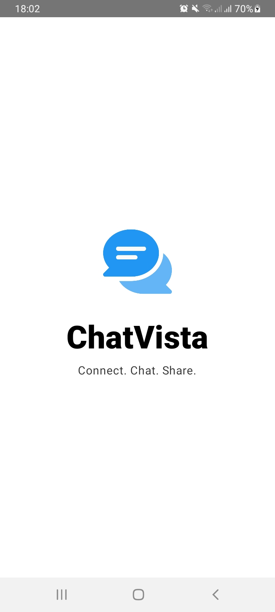
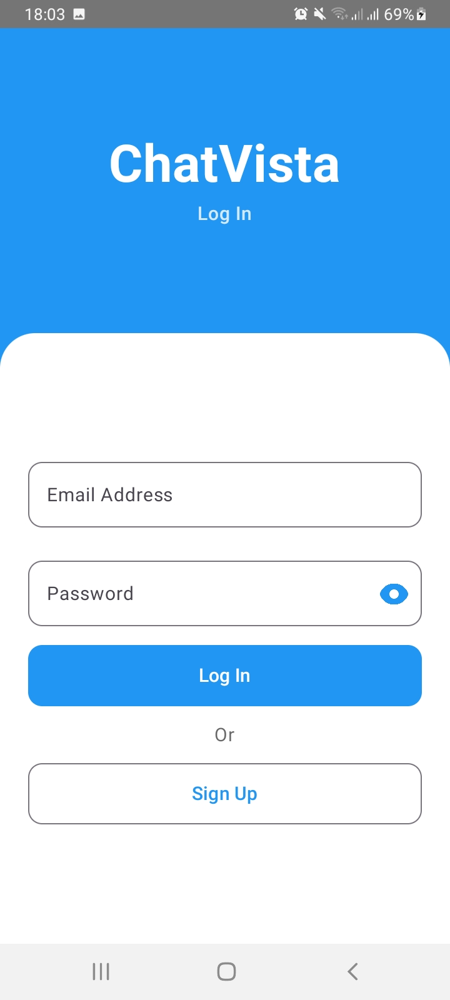
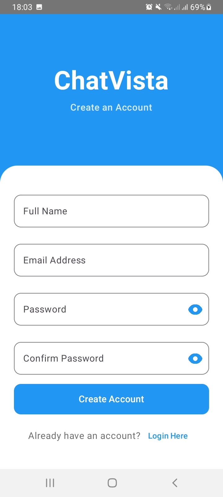
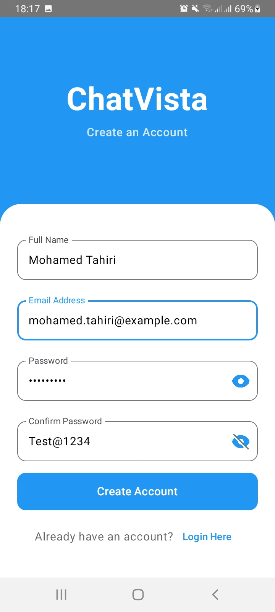
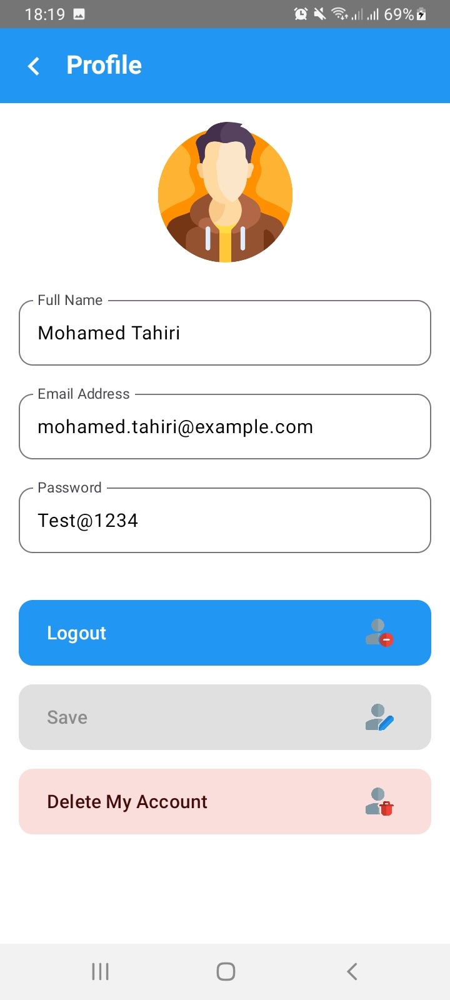
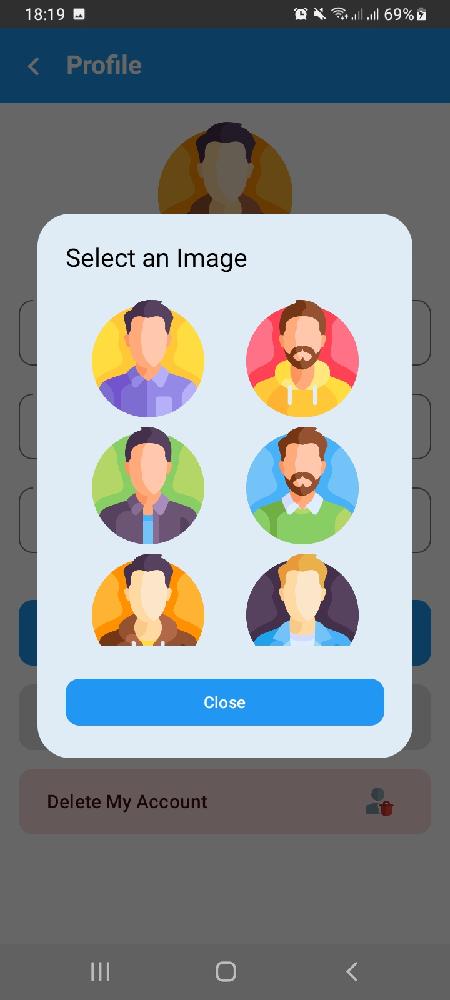
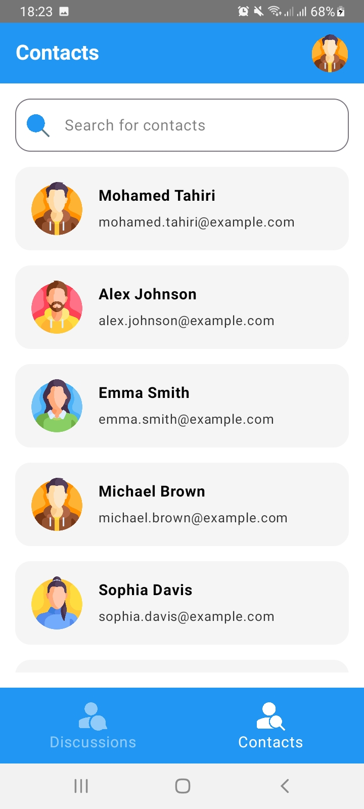
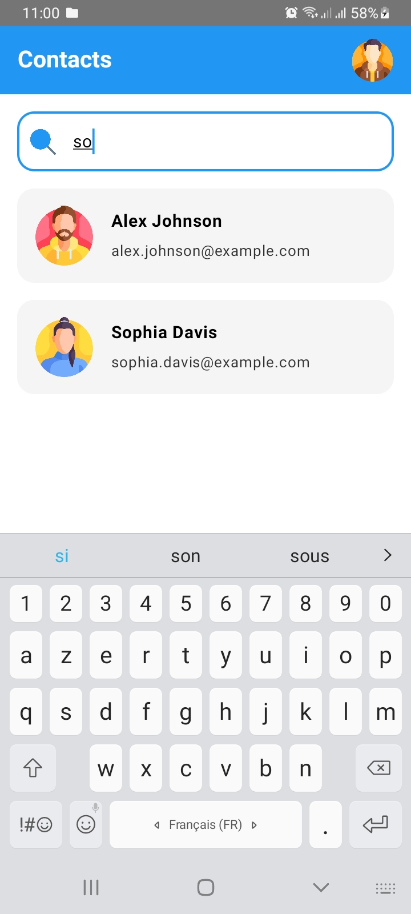
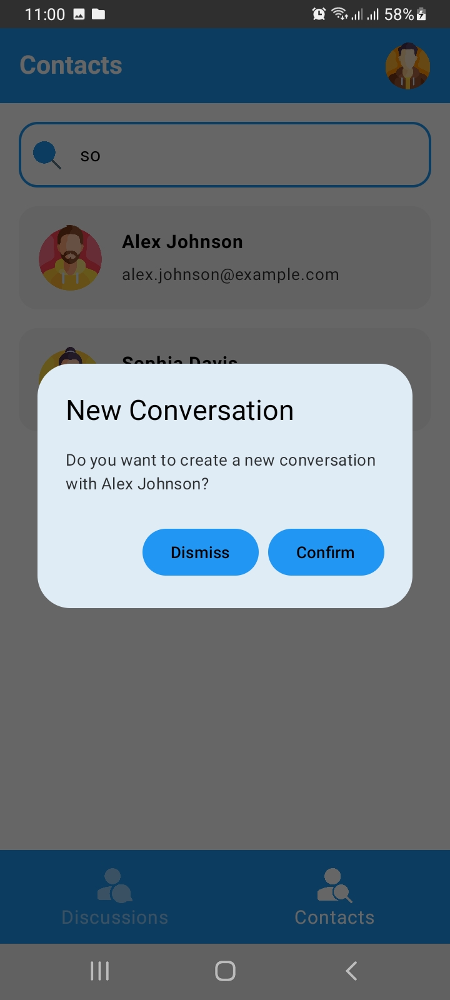
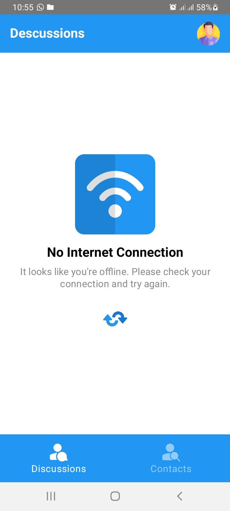


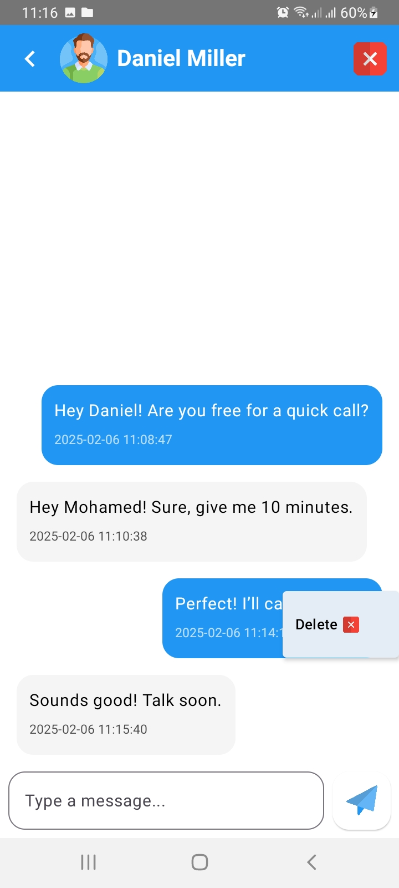
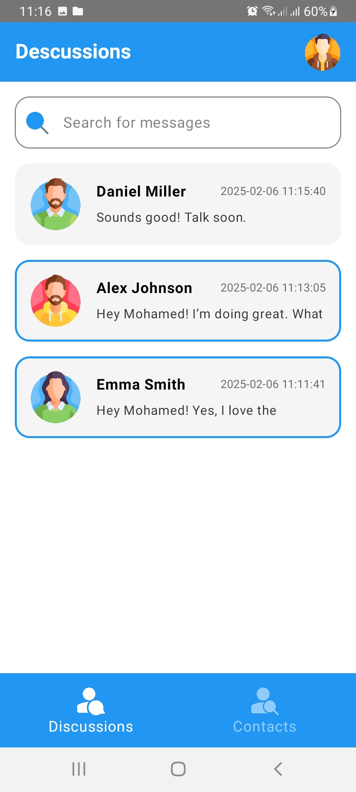
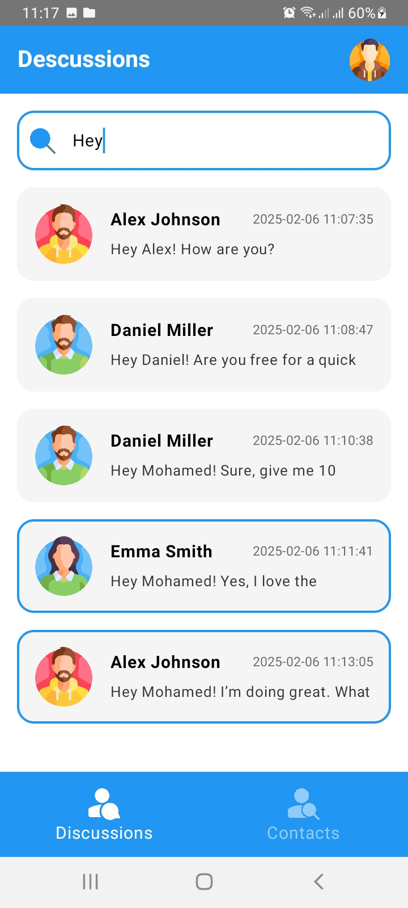

---

# 🛠 Tech Stack
## 📱 Android App (Frontend)
- **Programming Language**: Kotlin
- **UI Framework**: Jetpack Compose
- **Networking**: Retrofit
- **Dependency Injection**: Hilt
- **Navigation**: Jetpack Navigation for Compose
- **Data Storage**: DataStore Preferences
- **Architecture**: MVVM (Model-View-ViewModel)
- **Build Tools**: Gradle (KSP for annotation processing)

## 🖥 Backend (Spring Boot)
- **Framework**: Spring Boot
- **Programming Language**: Java
- **Database**: MySQL (JPA + Hibernate)
- **Dependency Management**: Spring Dependency Management Plugin
- **Build Tool**: Gradle
- **REST API**: Spring Web

---

# 🚀 Installation & Setup

Follow these steps to set up and run ChatVista locally.

## 📱 Android App Setup
1️⃣ Clone the Repository
```
git clone https://github.com/MedTahiri/chatvista.git
cd chatvista/android
```
2️⃣ Open in Android Studio

Open Android Studio and select the android directory.

3️⃣ Configure API Base URL
- update NetworkModule.kt in app/src/main/java/com/mohamed/tahiri/android/model
```
@Provides
    @Singleton
    fun provideRetrofit(okHttpClient: OkHttpClient): Retrofit {
        return Retrofit.Builder()
            .baseUrl("backend API URL")
            .client(okHttpClient)
            .addConverterFactory(GsonConverterFactory.create())
            .build()
    }
```
- update network_security_config.xml in app/src/main/res/xml
```
<domain includeSubdomains="true">backend API URL</domain>
```

- 
Use "http://localhost:8080" if testing on a physical device with a local backend server

4️⃣ Build & Run

Click Run ▶️ in Android Studio to launch the app on an emulator or device.

## 🖥 Backend (Spring Boot) Setup
1️⃣ Clone the Repository
```
git clone https://github.com/MedTahiri/chatvista.git
cd chatvista/backend
```
2️⃣ Configure Database

- Install MySQL and create a database named chatvista.
- Update application.properties in src/main/resources/:

```
spring.datasource.url=jdbc:mysql://localhost:3306/chatvista
spring.datasource.username=root
spring.datasource.password=your_password
spring.datasource.driver-class-name=com.mysql.cj.jdbc.Driver
```
3️⃣ Build & Run the Backend

```
./gradlew bootRun  # For Linux/Mac
gradlew.bat bootRun  # For Windows
```
- The backend will start at http://localhost:8080.

Now your ChatVista app is ready to use! 🎉

---
# 📂 Project Structure

The project is divided into two main parts:

```
chatvista/
│── android/            # Android app (Frontend)
│   ├── app/            # Main Android application source
│   │   ├── src/        # Kotlin source files and resources
│   │   ├── build.gradle.kts  # Gradle configuration for Android
│── backend/            # Spring Boot backend (Server)
│   ├── src/            # Java source files
│   │   ├── main/
│   │   │   ├── java/com/mohamed/tahiri/chatvista/  # Main backend package
│   │   │   ├── resources/  # Configuration files (application.properties)
│   ├── build.gradle.kts  # Gradle configuration for Spring Boot
│── README.md           # Project documentation
│── .gitignore          # Git ignored files
│── LICENSE             # License information
```

---

# 🤝 Contributing
We welcome contributions from the community! If you'd like to contribute to ChatVista, please follow these steps:

1️⃣ Fork the Repository

- Fork the project to your GitHub account.

 2️⃣ Clone the Forked Repository

```
git clone https://github.com/your-username/chatvista.git
cd chatvista
```

3️⃣ Create a New Branch
```
git checkout -b feature/your-feature-name
```

4️⃣ Make Your Changes
- Follow the coding guidelines and ensure your code is well-documented.

5️⃣ Commit Your Changes

- Write clear and concise commit messages.
```
git commit -m "Add: Your feature description"
```

6️⃣ Push to Your Branch
```
git push origin feature/your-feature-name
```

7️⃣ Open a Pull Request
- Go to the original repository and open a pull request.

- Provide a detailed description of your changes.

---

# Thank you for using ChatVista! 🚀